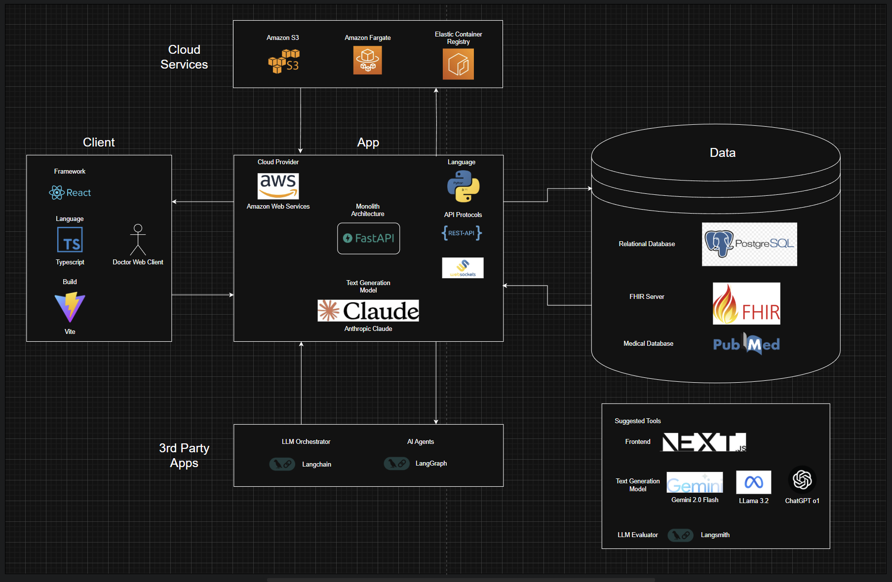

# Medical Q&A Assistant

The Medical Q&A Assistant is designed to help healthcare professionals access accurate, up-to-date medical information
quickly and efficiently, and receive patient-specific, evidence-based guidance that supports informed decision-making.

# Table of Contents

- [Project Documents](#project-documents)
    - [PRD](#prd)
    - [SDD](#sdd)

# Project Documents

## PRD

- [Product Requirements Document](https://docs.google.com/document/d/1IniaDH8GKU2Dc7S5iknQ-0xp-TKQhcTMFqCXqa2tJnA/edit?usp=sharing).

## SDD

- [Software Design Document](https://docs.google.com/document/d/1wwXSxvEWjZlva07T5xaIKCLfi9hffwUceoJrnCcZMQY/edit?usp=sharing).

# Tech Stack

# High Level Architecture

# Backend

The **Medical Q&A Assistant** backend is a LangChain-powered system designed to provide evidence-based medical answers
tailored to individual patients' data. The system integrates with FHIR servers to fetch medical records, enabling
healthcare professionals to query both general medical knowledge and patient-specific information.

#### Features:

- Seamlessly fetch patient records such as encounters, conditions, and demographics using FHIR integration.
- Provide real-time, personalized medical insights by combining patient data with trusted medical knowledge bases.
- Support for structured and unstructured queries to enhance decision-making during patient care.

For detailed setup, usage instructions, and API documentation, please visit the [Backend README](./backend/README.md).

---
