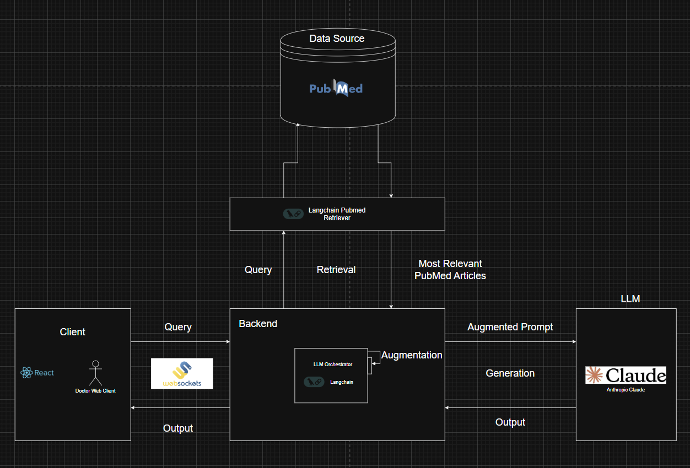
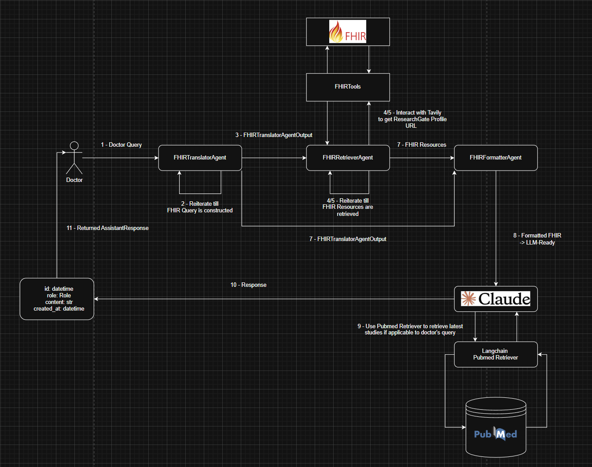

# Medical Q&A Assistant Backend

# Table of Contents

- [Architecture](#architecture)
- [Getting Started](#getting-started)
    - [Prerequisites](#prerequisites)
    - [Setup](#setup)
- [Project Structure](#project-structure)

# Architecture

## General Medical QA Flow Architecture



## Patient Medical QA Flow Architecture



# Getting Started

## Prerequisites

- Python must be installed on local device. You can install it from
  the [Python installation guide](https://www.python.org/downloads/).
- uv must be installed, as it is used here as the dependency manager. You can install it from
  the [uv installation guide](https://docs.astral.sh/uv/getting-started/installation/).

## Environment Variables

| Variable                  | Description                                                                                |
|---------------------------|--------------------------------------------------------------------------------------------|
| `APP_NAME`                | The name of the application (e.g., MEDICAL_Q&A_ASSISTANT).                                 |
| `APP_VERSION`             | The version of the application (e.g., 0.0.1).                                              |
| `ENVIRONMENT`             | Application environment (Options: development, staging, production; default: development). |
| `MODEL_ID`                | The model ID for LLM (e.g., us.anthropic.claude-3-7-sonnet-20250219-v1:0).                 |
| `MODEL_TEMPERATURE`       | Temperature setting for the model (0.0 - 1.0; default: 0.1).                               |
| `MODEL_MAX_TOKENS`        | Maximum tokens allowed for the model (e.g., 2048).                                         |
| `RETRIEVER_API_KEY`       | API key for the retriever integration.                                                     |
| `RETRIEVER_TOP_K_RESULTS` | Maximum number of top K results to retrieve (e.g., 10).                                    |
| `FHIR_CLIENT_APP_ID`      | The app ID for the FHIR client.                                                            |
| `FHIR_CLIENT_API_BASE`    | The base API endpoint for the FHIR client.                                                 |
| `CORS_ORIGINS`            | List of allowed CORS origins (e.g., `["http://localhost","http://localhost:5173"]`).       |
| `AWS_ACCESS_KEY_ID`       | AWS access key for integrations.                                                           |
| `AWS_SECRET_ACCESS_KEY`   | AWS secret access key for integrations.                                                    |
| `AWS_REGION`              | AWS region for the service.                                                                |

## Setup

1. **Clone the repository**
    - cd into backend:
      ``` 
      cd backend
2. **Create `.env` File:**
    - Create a `.env` file inside the `./app` directory, where it contains source code.
    - Add the following content to the `.env` file based on `.env.template`:
3. **Setup virtual environment for the project**
    - Run in terminal:
      ``` 
      uv sync
      uv lock
    - After running commands this should create a .venv folder if not:
      ``` 
      uv venv
    - Choose the local python interpreter by selecting the current virtual environment in the used IDE.
    - Choose existing not generating new one, and select the following `.venv\Scripts\python.exe`.
4. **Run Project**
    - After setting up virtual environment enter the `./app` directory and run the main function in the `main.py`.

# APIs

| Endpoint                                          | Method | Summary               | Description                                                                                        |
|---------------------------------------------------|--------|-----------------------|----------------------------------------------------------------------------------------------------|
| `/api/v1/healthy`                                 | GET    | Health Check          | Checks the health of the API to ensure it is running properly.                                     |
| `/api/v1/patients`                                | GET    | Get Many              | Retrieves a list of all patients.                                                                  |
| `/api/v1/patients/{patient_id}`                   | GET    | Get One               | Fetches details of a specific patient by their ID.                                                 |
| `/api/v1/encounters/recent/patients/{patient_id}` | GET    | Get Recent Encounters | Retrieves the most recent encounters for a specific patient. Optionally, a count can be specified. |
| `/api/v1/conditions/latest/patients/{patient_id}` | GET    | Get Latest Condition  | Fetches the latest condition details for a specific patient.                                       |

# **Project Structure**

The core application code is organized here. It adheres to the layered architecture, with each layer encapsulating
specific functionality.

## **business/**

Handles the application's business logic.

- **`clients/`**:  
  Contains integration logic for third-party services (e.g., authentication, LLM communication).  
  Example: `AuthenticationClient` and `LLMClient` for external API calls.

- **`dependencies.py`**:  
  Shared business dependencies such as client initializations or common business-level utility functions.

- **`mappers/`**:  
  Converts data structures between business logic and data layers.

- **`services/`**:  
  Contains core business logic. Service classes orchestrate workflows between clients, repositories, and other layers.

---

## **config/**

Handles application configuration.

- **`settings.py`**:  
  Manages application configuration settings (e.g., environment variables, API keys).

---

## **data/**

Deals with persistence and database-related logic.

- **`database/`**:  
  Database connection and session handling.

- **`models/`**:  
  ORM models (e.g., SQLAlchemy models) for database tables.

- **`repositories/`**:  
  Handles data access logic, isolating queries from the business logic.

---

## **presentation/**

Defines the presentation layer, including API routes, request/response validation, and middleware.

- **`dependencies.py`**:  
  Shared dependencies for request handling (e.g., authentication).

- **`mappers/`**:  
  Maps between request/response schemas and domain objects.

- **`middleware/`**:  
  Custom middleware for request/response lifecycle events.

- **`routers/`**:  
  Organizes API endpoints into modules.
    - **`v1/`**:  
      Versioned API routes for backward compatibility.

- **`schemas/`**:  
  Pydantic models for request and response validation.
    - **`request/`**:  
      Defines input validation schemas.
    - **`response/`**:  
      Defines output validation schemas.